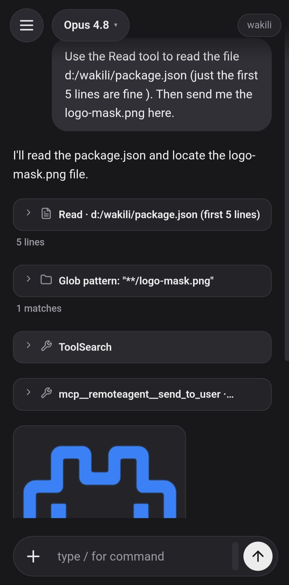
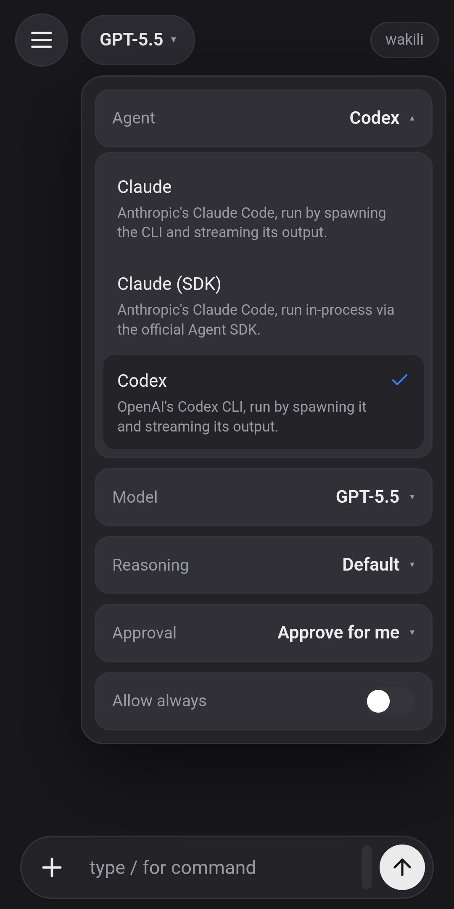
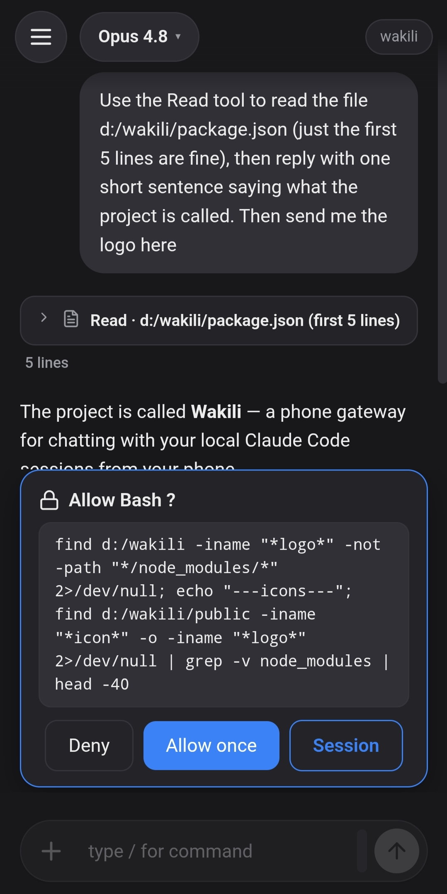
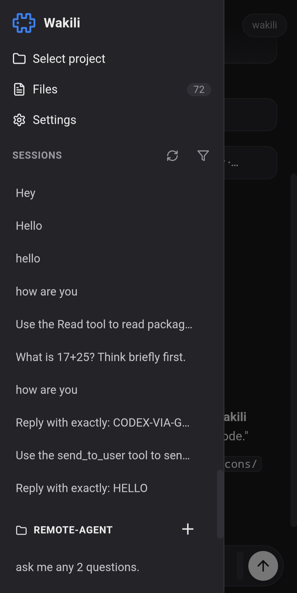
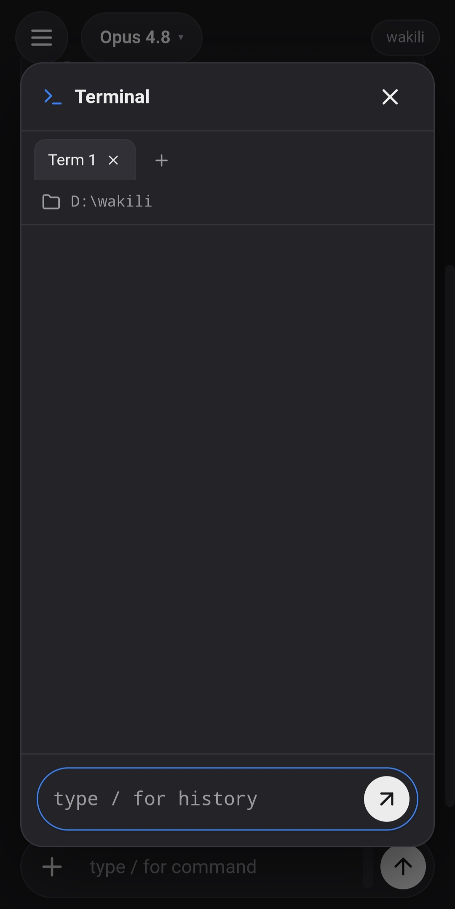

<p align="center">
  
</p>

<h1 align="center">Wakili</h1>

<p align="center">
  =20" />
  
  
  
</p>

Control and chat with Claude Code and Codex from your phone using Wakili app. Run it on your
computer and drive your agent sessions remotely — over your LAN, securely via Tailscale, or
publicly via a Cloudflare tunnel. Pick your agent per message — Claude Code, Claude (official
Agent SDK), or Codex — and choose its model (Opus 4.8, GPT‑5.5, …), reasoning effort, and
approval mode. Every chat is kept as its own thread in a sessions sidebar, and you can switch
the working project or browse its files without leaving the app.

- Streaming output and tool/permission cards
- File upload/download
- A built-in **terminal**
- Remote **power controls** — lock the screen, blank the display, keep the machine awake
- An in-app connection switcher

<p align="center">
  
  &nbsp;&nbsp;
  
  &nbsp;&nbsp;
  
</p>

<p align="center">
  
  &nbsp;&nbsp;
  
</p>

---

## Prerequisites

- **Node.js 20+**
- **Claude Code or Codex installed** — on your `PATH` and authenticated (per that tool's own docs).
- **Outside the LAN:** Tailscale or cloudflared.

There are **no npm dependencies** — nothing to `npm install`. The project runs on Node
built-ins plus those external CLIs.

---

## Quick start

1. **Install Tailscale** on both the computer and the phone, and **sign in with the same
   account** on each (this puts both devices on your private tailnet).
2. **Start the gateway** on the computer:
   ```bash
   npm start
   ```
3. **Open Wakili on your phone**, any of:
   - **Android app** — [download the latest APK](https://github.com/ahmeedgamil/wakili/releases/latest/download/wakili.apk).
   - **Build it yourself** — from [`wakili-react-native/`](wakili-react-native/).
   - **Web** — point the phone camera at the QR code printed in the terminal to open the
     app in the browser.

On first run a random access token is generated and saved to `~/.wakili/token.txt`; the
URL carries it (`?t=…`) so opening the link "just works." Each chat is a JSON file under
`~/.wakili/sessions/` (the project it runs in is saved as a `cwd` field inside it), and
uploads live in `~/.wakili/uploads/` (override the base with `WAKILI_HOME`).

---

## Connection modes

Pick a mode by **which command you run** on the computer. Every mode prints one or more
URLs **and a scannable QR code** in the terminal — on the phone you can either scan the
QR with the camera or open the URL by hand. Every URL already contains the access token
(`?t=…`), which the phone saves after the first open, so there's nothing to type.

Quick reference:

| Mode | Reaches from | Computer command | Phone opens |
|------|--------------|----------------|-------------|
| **Local network** | same Wi‑Fi only | `npm start` | `http://<lan-ip>:8730/?t=…` |
| **Tailscale** | anywhere (private) | `npm start` or `npm run tailscale` | `http://100.x.x.x:8730/?t=…` |
| **Cloudflare** | anywhere (public) | `npm run cloudflare` | `https://<name>.trycloudflare.com/cf.html?t=…` |

`Ctrl+C` in the terminal stops the gateway (and the bridge too, for `npm run cloudflare`).

---

### Mode 1 — Local network (same Wi‑Fi)

The simplest mode: the phone talks to the computer directly over your Wi‑Fi. Nothing to
install.

1. Put the **computer and phone on the same Wi‑Fi network**.
2. On the computer: `npm start`.
3. The terminal prints a **`Phone:` line** (`http://<lan-ip>:8730/?t=…`) and a **QR code**
   under *"Scan to open on your phone (same Wi‑Fi)"*. (The `Computer:` `localhost` line is
   for opening on the computer itself.)
4. On the phone: **scan the QR** with the camera, or type the `Phone:` URL into the browser.
5. Done — the page loads and the token is saved.

> If it won't load: you're not on the same Wi‑Fi, or the computer's firewall is blocking
> port `8730`. When Windows first pops the *"Windows Defender Firewall has blocked
> Node.js"* dialog, tick **Private networks** and click **Allow access**. If you dismissed
> it, add the rule from an **elevated PowerShell**:
>
> ```powershell
> New-NetFirewallRule -DisplayName "Wakili 8730" -Direction Inbound -Action Allow -Protocol TCP -LocalPort 8730
> ```
>
> On macOS/Linux, allow Node (or port `8730`) through the OS firewall. This only affects
> Local network mode — Tailscale and Cloudflare tunnel out and need no inbound rule.

---

### Mode 2 — Tailscale (private, from anywhere)

Tailscale builds a **private network** between your devices, so the phone reaches the
computer from **any network (cellular, another Wi‑Fi)** without exposing anything publicly.
Both devices must be signed into the **same Tailscale account**.

1. **Install Tailscale on the computer** — download from `tailscale.com/download`, install,
   and **sign in** (Google/Microsoft/GitHub/email — remember which account).
2. **Install the Tailscale app on the phone** — from the App Store / Google Play — and
   **sign in with the *same* account** as the computer.
3. **Turn Tailscale ON on both devices** (the app toggle must be connected/green). Now
   both are on the same private "tailnet".
4. On the computer: `npm start` (Tailscale is auto‑detected) — or `npm run tailscale`.
5. The terminal prints a **`Tunnel:` line** (`http://100.x.x.x:8730/?t=…`, a `100.x`
   address) and a **QR code** under *"Scan to connect from anywhere (Tailscale)"*.
6. On the phone, **with the Tailscale app still turned ON**, scan that QR or open the
   `100.x` URL.

> Common misses: signing into **different** accounts on the two devices; forgetting to
> **toggle Tailscale on** on the phone before opening the link; or using the `100.x` URL
> while the phone's Tailscale is off. All three break the connection. Nothing is public —
> only your tailnet devices can reach it.

---

### Mode 3 — Cloudflare (public, from anywhere, no account)

Cloudflare gives a **public https URL** reachable from any network with **no shared
account** — handy when you can't use Tailscale. The access **token** is what keeps it
private, so guard the URL.

1. **Install `cloudflared` on the computer** — from Cloudflare's downloads page. **No login
   or Cloudflare account is needed** for a quick tunnel.
2. On the computer: `npm run cloudflare`. This starts the gateway **and** the Cloudflare
   bridge together (one command).
3. The terminal prints a **`https://<name>.trycloudflare.com/cf.html?t=…` URL** and a
   **QR code**. Note it ends in **`/cf.html`** — that's the correct page for this mode.
4. On the phone — **any network, Wi‑Fi or cellular** — scan the QR or open that URL.

> Important:
> - The URL is **random and changes every time** you restart `npm run cloudflare`. Re‑scan
>   the new QR after a restart. (The in‑app connection switcher always shows the current one.)
> - It is a **public** URL — treat it like a password; anyone with it *and* the token could
>   reach your gateway. Token‑only auth (no admin/admin) is the guard.
> - Use **`npm run cloudflare`**, not `node server.mjs --tunnel cloudflare`. The plain flag
>   gives a public URL but Cloudflare buffers the live stream, so streaming breaks; the
>   bridge relays it over a WebSocket (served at `/cf.html`) that Cloudflare won't buffer.

---

## Switching connections from the app

Inside the web page, the **🔌 Connection** button (sidebar footer) lists every URL the
same gateway is reachable on — Local network, Tailscale, Cloudflare — and switches to
the one you pick. They all reach the same gateway, so your sessions come along. (A
target only connects if the phone's current network can actually reach it.)

---

## Configuration

Set these in `.env` (copy from `.env.example`) or as real environment variables
(shell env wins). All optional.

| Variable | Default | Purpose |
|----------|---------|---------|
| `PORT` | `8730` | Gateway port. |
| `WAKILI_TOKEN` | auto-generated | Access token (the only credential). Unset → generated & persisted to `~/.wakili/token.txt`. |
| `WAKILI_CLAUDE_ENTRYPOINT` | `claude-vscode` | Which editor's resume list your chats appear in (`claude-vscode` / `cli` / `sdk-cli`). |
| `WAKILI_HOME` | `~/.wakili` | Where the runtime store (sessions, token, uploads) lives. |
| `CF_BRIDGE_PORT` | `8731` | Port for the Cloudflare bridge. |
| `WAKILI_KEEP_AWAKE` | `1` | Keep the machine awake while running (screen can still lock). `0` to opt out. |

Deeper settings live in [`src/config.mjs`](src/config.mjs).

---

## npm scripts

| Script | Does |
|--------|------|
| `npm start` | Gateway, auto mode (LAN + Tailscale if present). |
| `npm run tailscale` | Gateway, Tailscale only. |
| `npm run cloudflare` | Gateway **+** Cloudflare bridge together. |
| `npm run bridge` | The Cloudflare bridge alone (gateway must already be running). |
| `npm run lan` | Gateway, LAN only (no tunnel). |

---

## Security notes

- Access is **token-only** — opening the page requires the `?t=…` token from the QR or
  link. There's no password to guess, but treat that URL like a password, especially
  over a public Cloudflare tunnel.
- The token is 24 random bytes, auto-generated and saved to `~/.wakili/token.txt`. Delete
  that file to rotate it (a fresh one is generated on the next start).
- The store lives in `~/.wakili/` — outside the repo, so your token and session history
  can't be committed by accident. `.env` is git-ignored too.
